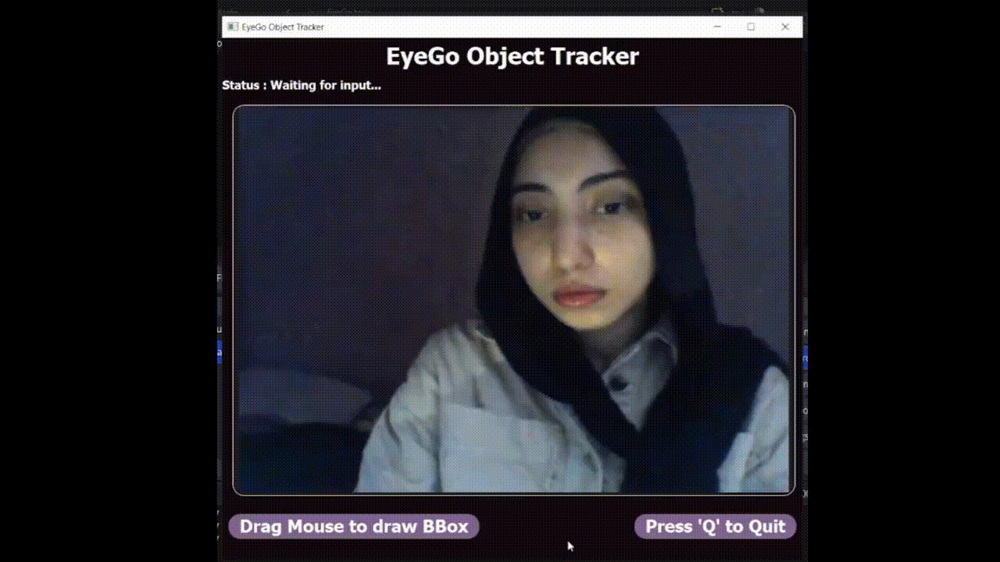

# Real-Time Interactive Object Tracker

A desktop application built with **PyQt5** and **OpenCV** that enables real-time single-object tracking from a live camera feed. Users can dynamically draw a bounding box around any arbitrary target to track it.

---

## Demo




---

## Key Features

* **Interactive Target Selection:** Custom-built interactive UI label (`InteractiveVideoLabel`) capturing mouse events (`press`, `move`, `release`) for intuitive drag-and-drop bounding box creation.
* **Robust Classical Tracking:** Powered by OpenCV's **CSRT** (Channel and Spatial Reliability Tracker), offering superior scale adaptability and high tracking precision.
* **Object-Agnostic Approach:** Works on arbitrary objects without requiring class labels or offline deep learning datasets.
* **Responsive GUI Architecture:** Utilizes non-blocking `QTimer` frame updates to ensure smooth real-time video playback while preserving responsive UI interactions.
* **User Feedback & Status Monitoring:** Real-time state indicators (`Waiting for input`, `Drawing`, `Tracking Active`, `Recovering...`, and `Object Lost`).

---

## Architectural & Engineering Decisions

### 1. Why a Desktop Application (PyQt5)?
Real-time vision processing demands minimal pipeline latency. A local desktop environment eliminates browser video streaming overhead and latency, providing direct hardware access to the camera feed at consistent frame rates.

### 2. Why Classical Computer Vision (CSRT) over Deep Learning?
* **Resource Efficiency:** Deep learning trackers (e.g., Siamese networks or deep feature extractors) introduce heavy computational workloads requiring dedicated GPUs for real-time inference. CSRT operates efficiently on standard CPUs.
* **CSRT vs. Other Classical Trackers:** While trackers like KCF or MOSSE yield higher frame rates, CSRT was selected because it specifically handles scale shifts and spatial deformations much more reliably.

### 3. Separation of Concerns (SoC)
The codebase is structured into decoupled modules:
* `main.py`: Clean entry point initializing the Qt event loop.
* `tracker_app.py`: UI controller handling camera capture, timer ticks, coordinate mapping, and display logic.
* `interactive_label.py`: Specialized `QLabel` subclass dedicated entirely to mouse event handling and signal emission.
* `tracker_engine.py`: Encapsulated tracking logic isolated from the presentation layer.

---

## Project Structure

```text
├── main.py                # Application entry point
├── tracker_app.py         # Main window controller and UI logic
├── interactive_label.py   # Custom interactive Qt label for BBox drawing
├── tracker_engine.py      # Core OpenCV tracker interface
├── tracker.ui             # QtDesigner visual layout
├── .gitignore             # Git ignore patterns
└── README.md              # Project documentation

---

## Getting Started

### Prerequisites
* Python 3.8 or higher
* A functional webcam

### Installation & Setup

1. **Clone the repository:**
   ```bash
   git clone <YOUR_GITHUB_REPO_URL>
   cd <YOUR_REPO_NAME>
   ```

2. **Install dependencies:**
   *(Note: `opencv-contrib-python` is required for the CSRT tracker algorithm).*
   ```bash
   pip install PyQt5 opencv-python opencv-contrib-python
   ```

3. **Run the application:**
   ```bash
   python main.py
   ```

---

## How to Use

1. **Launch:** Run `main.py` to open the camera feed.
2. **Draw:** Left-click and drag the mouse over the object you want to track.
3. **Track:** Release the mouse button to lock onto the target and start tracking.
4. **Exit:** Press the **`Q`** key on your keyboard or close the window to safely exit.

---

## Limitations

* **Full Occlusion & Out-of-Frame Loss:** Because CSRT is a local-search algorithm, if the target completely leaves the camera frame or is fully occluded, the tracker will permanently lose it. It cannot automatically re-detect or reacquire the object if it re-enters the frame later.
* **Background Interference (Loose Bounding Boxes):** The tracker's accuracy relies heavily on the quality of the initial bounding box. If the user draws a bounding box that is too large and includes a significant amount of background noise, the tracker might learn the background as part of the target's features. If the actual object disappears, the tracker may get confused and falsely continue tracking the static background as a false positive.
